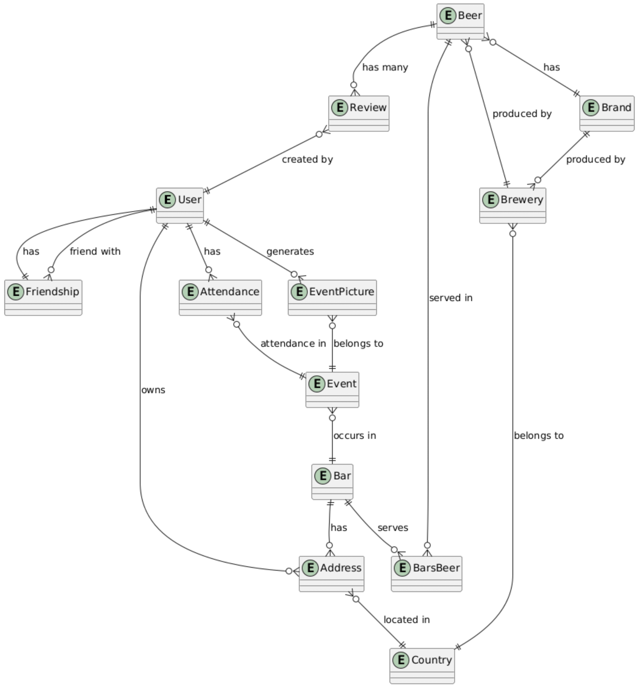
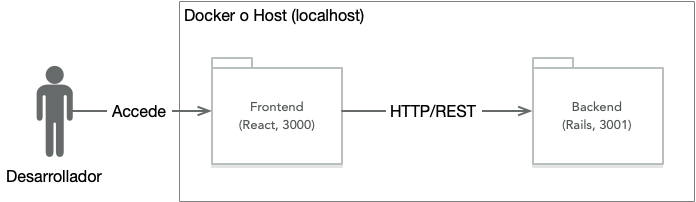

# Proyecto de Aplicaciones Móviles - Enunciado General del Proyecto

El proyecto del curso en este semestre consistirá en desarrollar una aplicación móvil para personas aficionadas a las cervezas, que frecuentan bares y eventos que se realizan en ellos. Los usuarios pueden evaluar cervezas y hacer amistades entre ellos. También pueden publicar fotos de los eventos a los que asisten en los bares, y etiquetarse.

El nombre de la aplicación lo definirá cada grupo, atendiendo la moral y las buenas costumbres, por supuesto.

## Entrega 1

Los requisitos de la primera entrega del proyecto están en el directorio `docs/entrega-1.1/enunciado.md` ([pinchar aquí](docs/entrega-1.1/enunciado.md)). Para las entregas siguientes, los enunciados se agregarán bajo el directorio `docs`. 

Para actualizar el código base del proyecto de acuerdo a los anuncios de los profesores (p.ej., para obtener el enunciado de la segunda entrega y siguientes), deben configurar un origen remoto "upstream" en su repositorio. Vean la sección "Uso del repositorio" más abajo en este mismo documento.

## Modelo de Dominio

El modelo de dominio de la aplicación que vamos a desarrollar tiene varias entidades y relaciones relevantes:

1. **Usuario** (`User`): Un usuario registrado en la aplicación
2. **Amistad** (`Friendship`): Una relación de amistad entre un `User` y otro.
3. **Dirección** (`Address`): Una dirección de un `User` que puede ir asociada a un `Bar`.
4. **Bar** (`Bar`): Un lugar en donde se sirven `Beer`s y se realizan `Event`s.
5. **Cerveza** (`Beer`): Una cerveza, producida por una `Brewery` y de una cierta `Brand`.
6. **Reseña** (`Review`): Una reseña escrita por un `User` sobre una `Beer`.
7. **Evento** (`Event`): Un evento que ocurre en un `Bar` y al cual asisten `User`s.
8. **Asistencia** (`Attendance`): La asistencia de un `User` en un `Event`.
9. **Imagen del Evento** (`EventPicture`): Una fotografía tomada por un `User` en un `Event`.
10. **Bar-Cerveza** (`BarsBeer`): Entidad intermedia para relación N-N entre `Bar` y `Beer`.
11. **Cervecería** (`Brewery`): Una cervecería que opera en un `Country`.
12. **Marca** (`Brand`): Una marca de `Beer` producida por una `Brewery`.
13. **País** (`Country`): Un país.

Relaciones:

1. **Un Usuario tiene cero o muchas Amistades** (`User` -- `Friendship`)
   - Un Usuario puede ser amigo de muchos otros Usuarios.
   
2. **Un Usuario es dueño de una Dirección** (`User` -- `Address`)
   - Un Usuario puede tener una Dirección.
   
3. **Un Bar tiene una Dirección** (`Bar` -- `Address`)
   - Un Bar puede estar ubicado en una Dirección.
   
4. **Una Cerveza tiene muchas Reseñas** (`Beer` -- `Review`)
   - Una Cerveza puede tener muchas Reseñas.
   
5. **Una Reseña es creada por un Usuario** (`Review` -- `User`)
   - Una Reseña es escrita por un Usuario.
   
6. **Un Evento ocurre en un Bar** (`Event` -- `Bar`)
   - Un Evento tiene lugar en un Bar.
   
7. **Un Usuario tiene Asistencia en un Evento** (`User` -- `Attendance` -- `Event`)
   - Un Usuario puede asistir a muchos Eventos y cada Asistencia está asociada con un Evento específico.
   
8. **Un Usuario genera muchas Imágenes del Evento** (`User` -- `EventPicture`)
   - Un Usuario puede crear muchas Imágenes de Eventos.
   
9. **Una Imagen del Evento pertenece a un Evento** (`EventPicture` -- `Event`)
   - Una Imagen del Evento está asociada con un Evento específico.
   
10. **Un Bar sirve muchas Cervezas y una Cerveza puede ser servida en muchos Bares** (`Bar` -- `BarsBeer` -- `Beer`)
    - Relación N-N entre Bar y Cerveza a través de la entidad intermedia `BarsBeer`.
   
11. **Una Cerveza es producida por una Cervecería** (`Beer` -- `Brewery`)
    - Una Cerveza es elaborada por una Cervecería.
   
12. **Una Cerveza tiene una Marca** (`Beer` -- `Brand`)
    - Cada Cerveza está asociada con una Marca específica.
   
13. **Una Cervecería produce muchas Marcas** (`Brewery` -- `Brand`)
    - Una Cervecería puede producir muchas Marcas.
   
14. **Una Cervecería pertenece a un País** (`Brewery` -- `Country`)
    - Una Cervecería está ubicada en un País.
   
15. **Una Dirección pertenece a un País** (`Address` -- `Country`)
    - Una Dirección está localizada en un País.



## Arquitectura del Proyecto Base

El proyecto base está conformado por una aplicación de backend (en directorio `backend`), desarrollada en Rails 7, y otra aplicación de frontend escrita en React, generada con la herramienta Vite (en directorio `www-frontend`). Además, en el futuro se agregará otra aplicación móvil híbrida en `hybrid-frontend`.

La aplicación Rails de backend ha sido generada en modo API, es decir, no tiene componentes de ActionView para renderizado de HTML, ni soporte para cookies. Esta aplicación contiene prácticamente todos los modelos necesarios, con validaciones relevantes y asociaciones. Las tablas tienen índices.

ActiveStorage viene pre-configurado en la aplicación de backend y algunos de los modelos como `Bar`, `Beer` e `Event` permiten adjuntar fotografías.

Devise y Devise-JWT también vienen pre-configurados y es posible usar la API del backend autenticando con tokens del tipo JavaScript Web Tokens (JWT).

La aplicación además tiene tests escritos con RSpec para la mayor parte de los modelos, y algunos controladores.

No todas las rutas están especificadas en la aplicación, ni todos los controladores están creados. Completar esto será trabajo de los grupos de proyecto.

La aplicación de frontend, creada con Vite, está en un nivel muy básico y será su trabajo completarla en el proyecto del curso.

En el despliegue de desarrollo, la aplicación Rails (API) está configurada para operar en el puerto 3001, y la aplicación de frontend en el 3000.

El esquema arquitectónico a ojos del desarrollador que trabaja en su máquina local es el siguiente:



## Requisitos Funcionales

Los requisitos funcionales de la aplicación que deberán desarrollar son los siguientes:

1. Los usuarios (ver modelo `User` y tabla en `db/schema.rb`) pueden registrarse ingresando nombre, apellido, email, un _handle_ (similar a X o Instagram, p.ej.,@kingofbeers), y datos de dirección opcionales (ver modelo `Address` y tabla en `db/schema.rb`).
2. Los usuarios pueden buscar bares en la aplicación por nombre.
3. Los usuarios pueden buscar bares por ubicación (país, ciudad, calle y número), usando un mapa.
4. Los usuarios pueden ver la lista de eventos (ver modelo `Event` en `schema.rb`) que se celebran en un Bar (modelo `Bar` y tabla en `schema.rb`).
5. Los usuario pueden buscar una cerveza en la aplicación (`Beer`), y ver los detalles de la cerveza, incluyendo qué cervecería la produce (`Brewery`), y qué bares la sirven.
6. Los usuarios pueden escribir evaluaciones (ver modelo `Review` y tabla en `schema.rb`) de las cervezas, con rating y texto.
7. Los usuarios pueden ver la evaluación global de una cerveza (rating promedio), junto con a su propia evaluación de la cerveza (si existe) y las evaluaciones de otros usuarios. 
7. Los usuarios pueden asistir (hacer "_check-in_") en un evento (ver modelo `Attendance` y tabla en `schema.rb`), y ver todos los usuarios que también han hecho _check-in_.
8. Los usuarios pueden subir fotografías a los eventos (ver modelo `EventPicture`). 
9. Los usuarios pueden ver las fotos de un evento como una galería, con scrolling.
10. Los usuarios pueden buscarse mutuamente en la aplicación usando _handle_, y agregarse como amigos (ver modelo `Friendship` y tabla en `schema.rb`), indicando el evento en donde se encontraron por primera vez opcionalmente.
11. Los usuarios pueden etiquetarse en las fotos de un evento.

En las entregas sucesivas del proyecto se les irá solicitando completar funcionalidad relativa a los requisitos anteriores, y se les dará más detalle sobre las funciones específicas a implementar.

## Posibilidad de realizar pruebas de carga y stress contra el Backend

Es posible utilizar la herramienta JMeter para realizar pruebas de rendimiento al backend. Para esto, existe un archivo de configuración para JMeter en `backend/test/jmeter/test_plan_beers.jmx`. El plan de pruebas tiene un grupo de threads preconfigurado para enviar requests a la aplicación.

Con la base de datos debidamente poblada, es posible realizar pruebas de carga al backend utilizando esta herramienta, y revisar el reporte resumen ("summary report").

## Iniciar la Aplicación

Si se opta por trabajar en el sistema operativo host en ambiente de desarrollo, instalando RVM y Node (ver sección de Herramientas Requeridas más adelante), entonces se debe iniciar la aplicación Rails con el backend, y el servidor web de Vite que sirve la aplicación React.

Antes de ejecutar la aplicación Rails por primera vez, es necesario crear una clave para los tokens de autenticación que son generados por el backend.

**Preparar clave para tokens de autenticación JWT generados por el backend Rails**

Para iniciar la aplicación Rails por primera vez, ir al directorio `backend` en la consola y ejecutar los siguientes pasos:

```sh
$ bundle install # verificar que las gemas queden instaladas correctamente
```
Luego, se debe crear un archivo de configuración encriptado para Rails, incluyendo la clave para los tokens JWT utilizados por devise-jwt. Para esto, asegurarse primero de eliminar archivos `config/credentials/*.yml.enc` si es que el repositorio los contiene.

```sh
$ rm config/*.yml.enc
```

Luego, se necesita crear una clave para que devise-jwt y Warden generen tokens JWT válidos:

```sh
$ rails runner "require 'securerandom'; puts SecureRandom.hex(64)"
```

Copiar la clave generada en la consola.

```sh
$ EDITOR="nano" rails credentials:edit --environment test
```

Al final del archivo agregar una línea con el siguiente contenido:

```
devise_jwt_secret_key: [clave generada por comando anterior sin estos corchetes]
```

Guardar el archivo y salir. Repetir cambiando la opción `--environment test` por `--environment development`. Si se va a realizar una instalación de producción, se debe también realizar este paso con el ambiente `production`.

**Ejecutar tests del backend Rails**

Luego, es posible ejecutar los tests:

```sh
$ bundle exec rspec # verificar que los tests pasen
```

**Iniciar la aplicación de backend Rails**

```sh
$ rails s # iniciar la aplicación
```

Las siguientes ejecuciones de la aplicación sólo requieren levantar el sevidor Puma con el comando `rails s`.

**Iniciar la aplicación de frontend con Vite**

Luego, para iniciar la aplicación React con Vite, se debe ir al directorio `www-frontend` en el repositorio y allí ejecutar:

```sh
$ npm install -g yarn
$ yarn install
$ yarn dev
```

Se puede detener la aplicación con Ctrl+C. Basta `yarn dev` para volver a ejecutar.

**Inicio de la aplicación con Docker**

En el directorio raíz de la aplicación hay un archivo de configuración `docker-compose.yml` preonfigurado para hacer funcionar las aplicaciones de `frontend` y `backend` en ambiente de desarrollo. Los sistemas de archivo de los contenedores quedan mapeados al sistema de archivos del host para acceder al código. Por esto, es importante realizar los pasos de generación de clave para token JWT en la aplicación Rails como se explica arriba antes de ejecutar con Docker.

Con Docker Compose, se instalarán automáticamente todas las imágenes necesarias. Ejecutar el siguiente comando:

```sh
$ docker-compose up
```

Se pueden detener las aplicaciones con `Ctrl+C`. Así queda compose utilizando el terminal actual para mostrar la salida de los contenedores. También se puede desacoplar del terminal:

```sh
$ docker-compose up -d
```

En este modo desacoplado se pueden inspeccionar los logs con:

```sh
$ docker logs -f
```

Para detener las aplicaciones

```sh
$ docker-compose down
```

Si tienes aplicaciones docker compose concurrentes (p.ej., en otros cursos), es una buena idea usar proyectos para rotular las imágenes y que no haya choques entre proyectos distintos:

```sh
$ docker-compose up -p appsmoviles -d
```

En este último caso, para detener la aplicación se puede usar el mismo comando de arriba (down). Se puede pasar el nombre del proyecto por variable de entorno:

```sh
$ COMPOSE_PROJECT_NAME=appsmoviles docker-compose down
```

Finalmente, hay situaciones en las que quedan contenedores huérfanos, por ejemplo, cuando hay caídas de contenedores. La forma de detener y eliminar contenedores huérfanos es a través del comando:

```sh
$ docker-compose down --remove-orphans
```

## Probar la API desde un cliente web

Es recomendable usar Postman para realizar pruebas de la API antes de implementar funcionalidad en el frontend. Para esto, considerar que:

* Hay una pequeña colección públicamente compartida de llamadas a la API, para Postman, que ha creado el profesor del curso, disponible en [https://bit.ly/icc4203-202420-project-postman-collection](https://bit.ly/icc4203-202420-project-postman-collection).
* Antes de llamar a las operaciones de la API, es necesario autenticarse con el sistema backend. Para esto se debe ejecutar la petición `POST http://localhost:3001/api/v1/signup` para crear una cuenta. Ver los detalles del usuario a crear en la pestaña "Body".
* Luego es necesario obtener un token JWT llamando a `POST http://localhost:3001/api/v1/login`, con el usuario y la clave utilizada en la petición anterior.
* Ver el token JWT en la respuesta de la llamada anterior. Copiarlo.
* Luego, es posible llamar a cualquier operación de la API usando el token JWT. Por ejemplo, ir a `POST http://localhost:3001/api/v1/bars`, y con esa solicitud crear un nuevo bar. Es necesario agregar un header (ir a pestaña Headers), con key "Authorization", y con el token JWT en valor (value). Se tiene que leer en value "Bearer [token JWT]".
* Es responsabilidad del cliente eliminar el token JWT cuando se deja de usar. Los tokens tienen vigencia de 24 hrs. una vez creados. Esto se ajusta en `backend/config/initializers/devise.rb` en `jwt.expiration_time`.

## Uso del repositorio

Cada grupo de proyecto obtiene su repositorio a través de una invitación de GitHub Classroom. Los grupos podrán crear libremente ramas locales y remotas para avanzar en el desarrollo de su aplicación. Sin embargo,

* Se considerará que la rama main contiene el último código estable que será revisado y evaluado por el ayudante.
* Pueden usar issues de GitHub en su repositorio para mantener registro de bugs, o features que requieran implementar.
* Para las entregas, antes de la fecha límite, deben crear un _pull request_ e incluir al ayudante de proyecto que tengan asignado. El _pull request_ puede ser creado sin requerir una mezcla de código. Más bien, su fin es que el ayudante pueda revisar el código y dejar su evaluación de cada aspecto en la entrega. El título del pull request debe decir "Revisión Entrega X", en donde X es el número de la entrega. La primera parte del proyecto (frontend web) tendrá números 1.1 a 1.5, y la segunda parte números 2.1 a 2.3.

Los profesores del grupo continuarán trabajando sobre el repositorio con el código base durante el semestre, para tanto para remediar posibles bugs como para proveer nuevas funciones relevantes para alguna de las entregas. Esto incluirá el código base para la segunda parte del proyecto en donde la aplicación de frontend será del tipo híbrido.

Para que los grupos puedan actualizar su repositorio con nuevos lanzamientos de código base, deben ejecutar los siguientes comandos su su repositorio local:

```sh
$ git remote add upstream https://github.com/icc4203-202420/project-base
```

Este comando permite agregar el repositorio de código base mantenido por los profesores del curso como otro origen remoto, de nombre "upstream". Luego, para aplicar los cambios que se encuentren en dicho repositorio en el repositorio local, se deben ejecutar los siguientes comandos:

```sh
$ git fetch upstream
$ git merge upstream/main
```

## Herramientas Requeridas para el desarrollo

Para desarrollar este proyecto, se requiere un entorno de programación que cuente con:

* Ruby Version Manager (RVM), capaz de ejecutar lenguaje Ruby 3.3.4, disponible en https://rvm.io. En Mac es importante instalar OpenSSL versión 1 para que ruby compile con RVM. Los comandos son:
```sh
$ brew install openssl@1.1
$ rvm install 3.3.4 -C --with-openssl-dir=$(brew --prefix openssl@1.1)
```
La aplicación rails en el directorio `backend` cuenta con archivos `.ruby-version` y `.ruby-gemset` que permiten cambiar automáticamente a la versión y gemset correcta.
* Node 18 o 20, instalable en [Mac con homebrew](https://formulae.brew.sh/formula/node@20), o en Linux ([Ubuntu](https://medium.com/@nsidana123/before-the-birth-of-of-node-js-15ee9262110c)), como sistema operativo host, en una máquina virtual, con Windows Subsystem for Linux (WSL), o con Docker.
* VSCode idealmente para editar el código
* Postman para realizar pruebas contra la API.
* Figma o Axure RP para prototipado de la interfaz de usuario (más indicaciones sobre esto en el enunciado 1.1 del proyecto).
* Docker no es estrictamente requerido, pero puede facilitar la instalación del ambiente de desarrollo, dado que el proyecto incluye archivo `docker-compose` y archivos `Dockerfile`. Así no se requeriría instalar todas las herramientas nombradas arriba, a excepción de VSCode.

Pueden usar la máquina virtual basada en Debian 12 que se encuentra disponible para descarga en el sitio del curso en Canvas, o bien, ustedes mismos instalar el software nombrado arriba.
